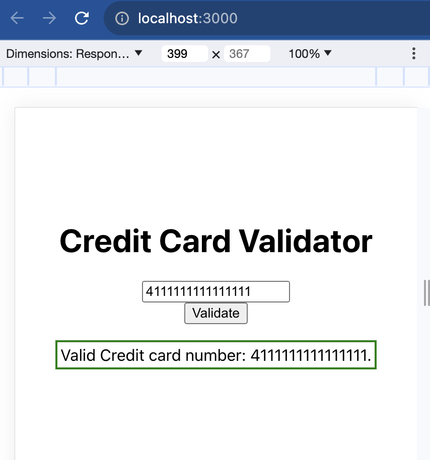
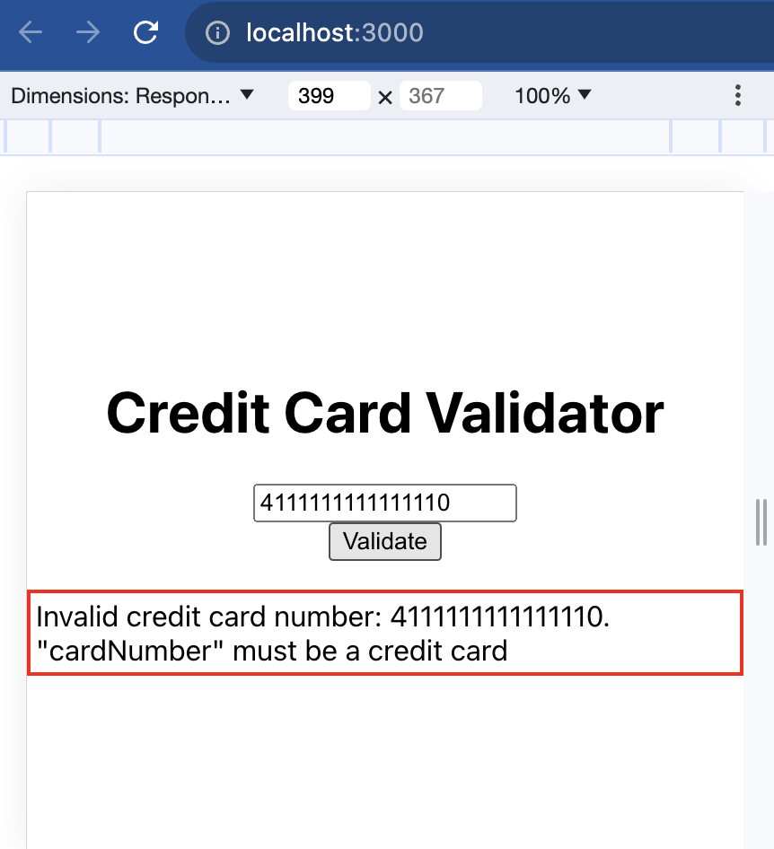
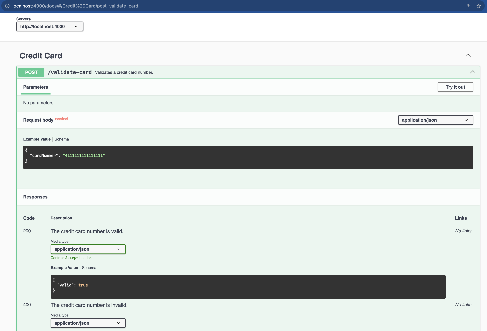

# Credit Card Validator

Take Home Assignment
Objectives:
- This take home assignment will allow us to have a more in depth
conversation in your follow up interview
Technical Requirements:
  - Use React, node.js and typescript for your application
  - Authentication and DB are not needed
Functional Requirements:
  - The main purpose of this application is to create a webpage to validate a
Credit Card number
  - Use the Luhn checksum algorithm for validation
  - Validation should happen in the back-end (API) not the frontend
Minimal UI Requirements:
  - At least one text box should be included for credit card input
  - Screen should display if the number is valid or not
Delivery
  - The team would like to review your case. It would be helpful to make your
case public for a short period of time. Please kindly remove "EngagedMD" as
the title when you make it public and please send the link over once you're
finished.

## Introduction

Welcome to the frontend of the Credit Card Validator application. This README will guide you on how to set up, run, and test both the frontend and the backend of our application.




## Prerequisites

- Node.js and npm installed on your machine.

## Installation

1. Navigate to the `credit-card-validator/frontend` directory:

   ```bash
   cd credit-card-validator/frontend
   ```

2. Install the necessary dependencies:
```bash 
npm install
```

### Running the Frontend
To start the React app:
```bash
npm run start
```
Once started, the application will be available at http://localhost:3000.

### Testing the Frontend
To run tests for the frontend:
```bash
npm run test
```

## Backend
### Running the Backend
The frontend communicates with a backend service. Before using the frontend, ensure the backend is running.

1. Navigate to the root directory credit-card-validator:
```bash
cd ..
```
2. Run the backend in watch mode:
```bash
npm run dev:watch
```

Once started, the backend server will be available at http://localhost:4000. The backend also serves the Swagger documentation at http://localhost:4000/docs/.

Docs: 


### Testing the Backend
To run the backend tests:
```bash
npm run test
```

> Thank you for using the Credit Card Validator. If you have any issues, questions, or feedback, please feel free to open an issue or contact the maintainers.
